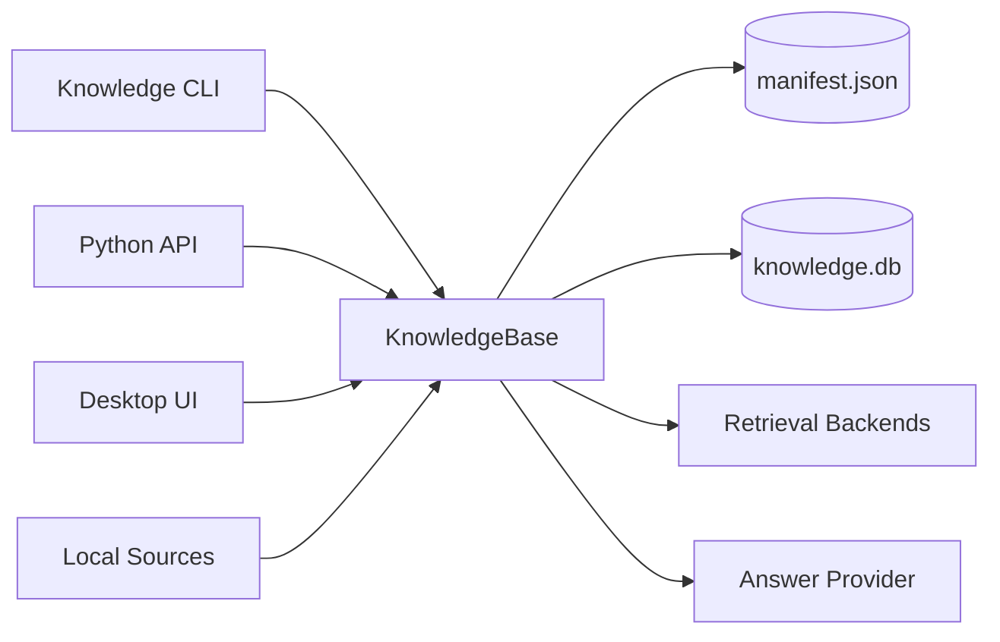
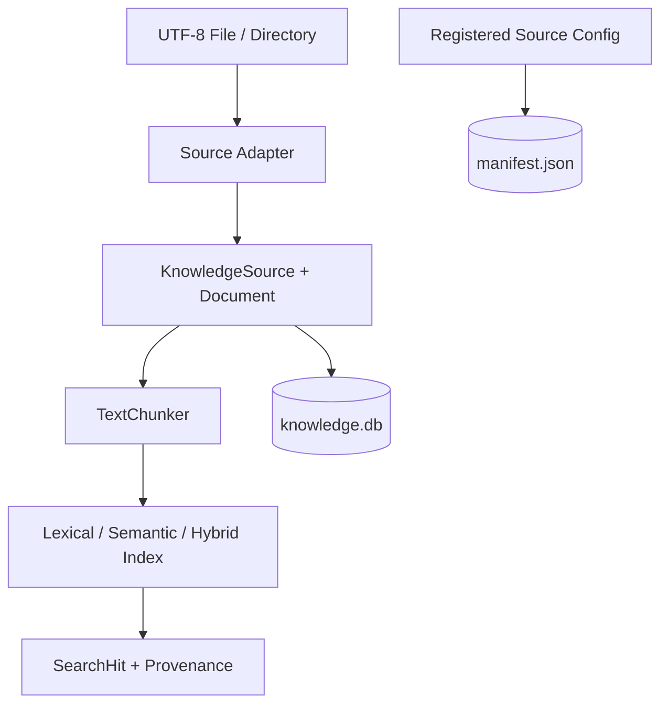
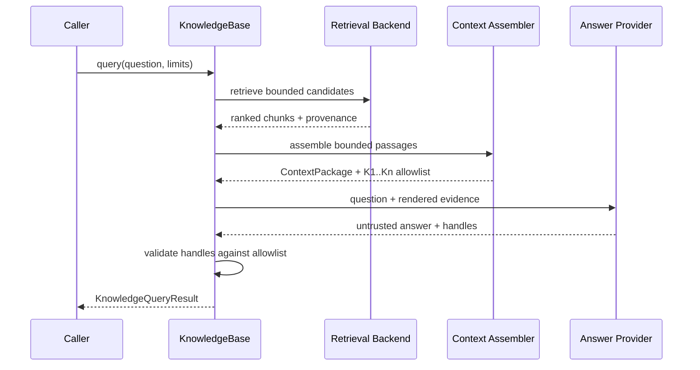

# NexusMind KnowledgeBase 技术架构

本文面向希望扩展或审计 NexusMind 的开发者。安装和使用方法见 [README](../README.md)。

## Knowledge Runtime

NexusMind 当前只关注 KnowledgeBase。CLI、Python API 和桌面 UI 都通过公开 `KnowledgeBase` API 进入同一条 Knowledge Runtime，不依赖 Agent Runtime、Tool Loop 或 MCP。



产品边界包括：

- Knowledge Store 与来源注册；
- ingestion、分块与 canonical provenance；
- lexical、semantic、Hybrid-RRF 和 reranking；
- context assembly、Answer Provider 与 citation validation；
- inspection、diagnostics 和 evaluation；
- CLI、Python API 与本地 UI。

## 数据模型与分层



- `RegisteredSourceConfig` 说明下一次从哪里加载；
- `KnowledgeSource` 表示上次成功同步后提交的来源 provenance；
- `Document` 由 `source_id + logical_path` 稳定定位；
- `content_hash` 使用 UTF-8 SHA-256 检测内容变化；
- `Chunk` 是 Document 的派生切片，字符偏移采用半开区间 `[start, end)`。

注册配置与 canonical source 不是同一份状态。`add_source()` 只原子保存注册，不读取文件；`sync()` / `sync_source()` 才读取并提交内容。全量同步整批成功后才提交，任一来源失败不会留下部分新状态。

## Ingestion

本地 adapter 当前支持严格 UTF-8 的 `.txt`、`.md` 和 `.markdown`，并限制单文件大小、文档数量、总读取字节、扫描条目数和目录深度。

目录扫描跳过符号链接、junction 和 Windows reparse point。Discovery 记录文件 identity；读取时复核 discovered、opened 和当前路径 identity 及 containment，降低扫描后路径替换导致越界读取的风险。

## 分块与检索

`TextChunker` 使用确定性字符分块，默认 `chunk_size=1000`、`overlap=100`、`max_chunks=10000`。Chunk ID 由 Document ID、content hash、字符区间和影响边界的配置派生。

### Lexical

默认 `UnicodeCJKLexicalAnalyzer` 执行 NFKC 检索归一化。非 Han 字母/数字连续段使用 `casefold()`，Han 连续段生成字符 bigram。BM25 默认参数为 `k1=1.2`、`b=0.75`；结果按 score 降序、`chunk_id` 升序稳定排序。

### Semantic

`EmbeddingProvider` 区分 `embed_documents()` 与 `embed_query()`。向量必须是 finite、non-zero 的不可变 float tuple。内置 OpenAI-compatible provider调用同步 `/v1/embeddings`，同步和查询可能产生网络延迟与费用。

### Hybrid 与 reranking

Hybrid-RRF 分别获取 lexical 和 semantic 排名，再按 `1 / (rrf_k + rank)` 融合。可选 reranker 只重排有界候选集。诊断结果保留每个阶段的 score、rank、RRF contribution 与 selected 状态。

所有 backend 的用户搜索结果都经过同一条最终路径：backend 先完成 lexical、semantic、fusion 和可选 reranking，`KnowledgeCollection.search()` 再从有界候选集执行 document-aware final selection，最后截断到调用方的 `limit`。该选择只比较同一次查询、同一 backend 输出中的相对 score，并返回原始排名的子序列；不会重算或改写选中候选的 score、matched terms 或 chunk provenance。

Search oversampling is bounded by optional backend capacity; a custom backend without valid capacity metadata receives the caller's original K. The selector's same-query relevance floor uses the lower median absolute deviation of only the raw Top-K backend scores, so isolated score outliers cannot widen the window. Diagnostics bypass both capacity-based oversampling and final selection.

诊断路径与最终选择严格隔离。`diagnose_search()` 直接请求 backend 的原始限制并返回 raw backend ranking，包括未修改的 stage、rank、score、RRF contribution 和 selected 状态；它不执行 oversampling 或 document-aware 选择。

Chunk、embedding、tokens、postings 和 index 都属于 derived runtime state，不写入产品存储；重新打开 KnowledgeBase 时从 canonical Documents 重建。

## Knowledge 查询流程



`AnswerGenerator` 是 Knowledge-domain contract，不执行检索。`OpenAICompatibleAnswerProvider` 直接调用非流式 Chat Completions，不依赖 Agent messages、runtime events 或 tool calls。

Provider 只返回未信任的答案文本与 `K1`、`K2` 等 handle。最终 `KnowledgeCitation` 只能由本次 `ContextPackage` 的 allowlist 构造；未知、重复、格式错误或未发送给模型的 handle 均 fail closed。

`AnswerGenerationLimits` 限制 question、context、passages、answer 与 citations。Provider HTTP 错误和响应解析错误会被映射为有限错误，不回显 API key、响应 body 或私有 context。

## KnowledgeBase 存储

```text
security-kb/
├── manifest.json          # 产品配置和已注册来源
├── knowledge.db           # canonical KnowledgeSource / Document
└── .knowledge-base.lock   # handle/process 间协调
```

`create()` 只接受不存在或已存在但为空的真实目录。`open()` 严格要求三个 artifact 存在、类型和身份有效，不会将缺失状态补成空库。

KnowledgeBase 的公开定位符是 root path；manifest 内生成的 `knowledge_base_id`
只承担内部持久化身份。Manifest v1 的根字段严格限定为
`format_version`, `knowledge_base_id`, and `sources`，不维护额外的用户名称。

Manifest 与 SQLite 使用各自唯一的 version 1 schema。来源 ID 由来源类型和规范化路径确定性派生；manifest 中保存的 ID 是完整性校验值，不接受调用者指定。SQLite 的完整 schema 同时包含 current sources、current documents 与不可变 document versions。非空 snapshot 必须携带 coherent version history；未知版本、不完整 schema 和缺失历史均直接拒绝，不执行迁移或历史合成。

同一实例的 mutation 由进程内锁串行化；不同 handle/process 使用 no-wait OS advisory lock。锁文件缺失、成为 symlink/reparse point 或 identity 被替换时均 fail closed。

`remove_source()` 先提交 SQLite，再原子替换 manifest；替换失败会补偿旧 snapshot，补偿也失败则 poison/close 当前对象。

### Persistence 的演进边界

Persistence 是 Knowledge Layer 的长期概念，不等于已删除的 Agent Run History。当前 canonical store 位于 `knowledge_store.py`；未来可按产品需求引入：

```text
persistence/
├── knowledge_store.py
├── query_trace_store.py
└── evaluation_record_store.py
```

Knowledge Trace、Query History 和 Evaluation Record 必须与 canonical state 明确区分，并默认采用显式启用、有界保存和敏感数据最小化原则。

## Knowledge-native Skill

当前版本不包含 Skill 系统。删除的是依赖 Agent Tool Registry、Tool Loop 和 MCP 的 Agent Skill，并非禁止未来的 Knowledge Skill。

未来可考虑 `citation_export`、`document_summary`、`knowledge_transform` 等 Knowledge-native Skill。它们应直接组合公开 Knowledge API，不重新引入 Agent execution contract。

## 检查与诊断

- `inspect()` 返回 coherent 的 manifest/canonical 当前视图，不扫描来源 dirty state；
- `inspect_document()` 从 canonical Document 重新派生和验证 chunk summary；
- `diagnose_search()` 单次执行当前 backend 的诊断路径，不先普通搜索再重复计算。

自定义索引不实现 `DiagnosticChunkIndex` 时仍可用于搜索、同步和恢复，但诊断会返回受控错误。

## 安全模型

- 默认 BM25 路径完全离线；
- 来源发现与读取具有路径、identity 和资源上限检查；
- 同步、删除和 manifest 更新遵守原子提交或补偿恢复；
- semantic provider 可能接收文档和查询；
- Answer Provider 会接收问题与选中的 bounded passages；
- 引用只能来自本次 context allowlist；
- provider、存储和诊断异常使用受控错误并 fail closed。

部署方应使用文件系统权限保护 manifest、SQLite、锁文件和 `.env`。使用外部 embedding/answer provider 前，应确认其数据处理与保留策略。

## 检索评估

`evals/knowledge/benchmark/` 离线比较 BM25、Semantic、Hybrid-RRF 和 Hybrid-RRF + Rerank，并输出 K=1/3/5/10 的 Hit@K、Recall@K 与 MRR。

```powershell
$env:PYTHONPATH = "src"
python -m nexusmind.retrieval_benchmark --write evals/knowledge/benchmark.md
```

报告是 descriptive/non-gate，不代表真实 embedding 模型质量。详见[检索比较报告](../evals/knowledge/benchmark.md)。

## 代码导航

| 模块 | 内容 |
| --- | --- |
| `knowledge_base.py` | 产品 API 与跨存储协调 |
| `knowledge_base_manifest.py` | 注册配置与 manifest contract |
| `knowledge_store.py` | canonical SQLite snapshot store |
| `knowledge_ingestion.py` | 本地来源 discovery 与读取 |
| `knowledge_chunking.py` | 确定性分块 |
| `knowledge_retrieval.py` | lexical contract 与 BM25 |
| `semantic_retrieval.py` | semantic index |
| `hybrid_retrieval.py` / `reranking.py` | fusion 与二阶段重排 |
| `context_assembly.py` | bounded passage assembly |
| `answer_provider.py` | Knowledge-native model provider |
| `knowledge_answer.py` / `knowledge_query.py` | 引用验证与统一 query pipeline |
| `knowledge_inspection.py` | inspection 与 diagnostics view |
| `cli.py` / `knowledge_base_ui.py` | 产品入口 |
